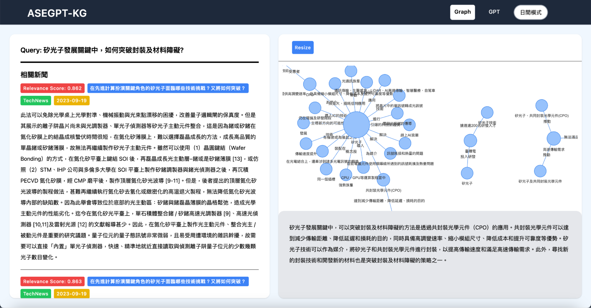
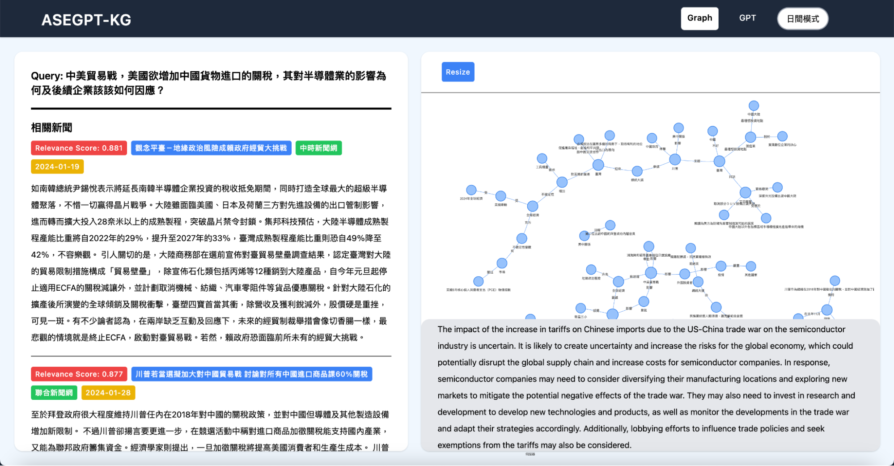
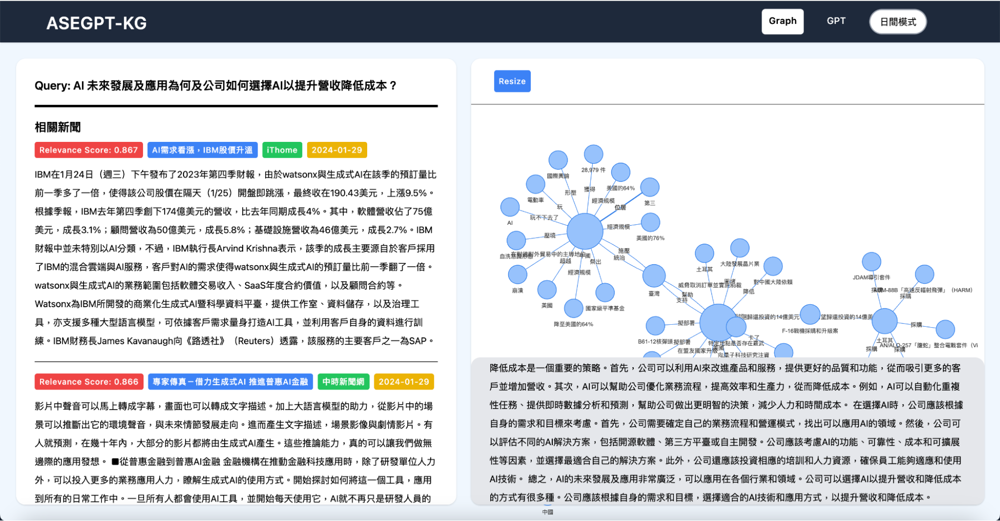

# ASEGPT-KG webui

|  | Service name |
| ---- | ---- |
|  **Frontend**    |  Next.js + TailwindCSS    |
|  **Backend**    |   Next.js (SSR) + FastAPI   |
| **RAG vector database** | NebulaGraph |
| **RAG generator** | Mistral |

## Screenshots







## Getting started

First, install the NebulaGraph and start the service.

```bash
sh start-nebula.sh
```

Local Development (allows for updated changes on page refresh)

```bash
docker compose -f docker-compose-dev.yml up
```

Go to http://localhost:8080

Production Deployment

```bash
docker compose up
```
